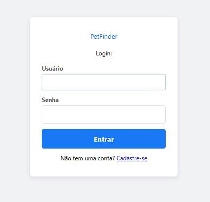
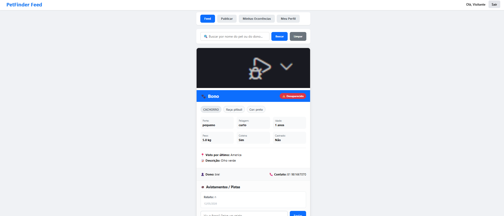
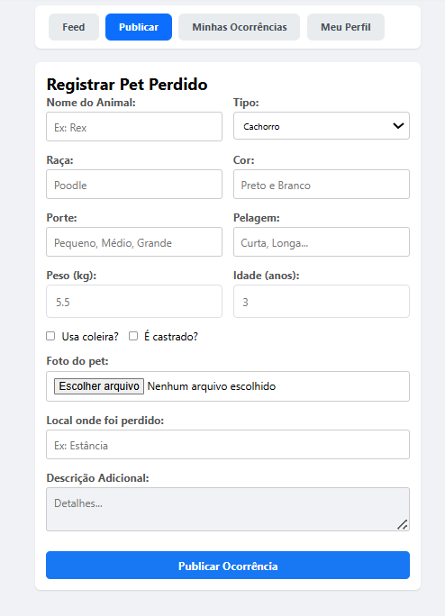
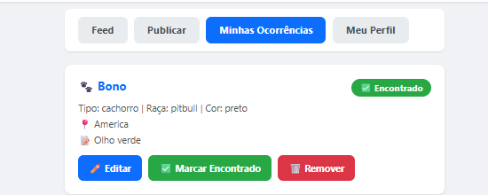
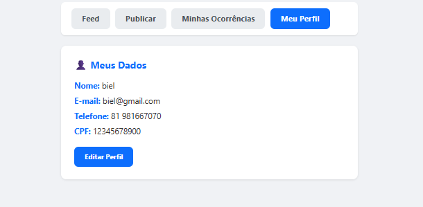

# 🐾 PetFinder Recife

Sistema web para reportar e localizar animais domésticos desaparecidos na cidade do Recife.

---

## 📑 Sumário

- [Estrutura de Pastas](#estrutura-de-pastas)
- [Descrição](#descricao)
- [O que o sistema faz](#o-que-o-sistema-faz)
- [Tecnologias](#tecnologias)
- [Como rodar](#como-rodar)
- [Recursos de POO](#recursos-de-poo)
- [Screenshots](#screenshots)
- [Links](#links)
- [Equipe](#equipe)

---

<a id="estrutura-de-pastas"></a>
## 🗂️ Estrutura de Pastas

```
petfinder-recife/
├── src/
│   ├── models/
│   │   ├── Pessoa.h / Pessoa.cpp
│   │   ├── Dono.h / Dono.cpp
│   │   ├── Usuario.h / Usuario.cpp
│   │   ├── Animal.h / Animal.cpp
│   │   ├── Cachorro.h / Cachorro.cpp
│   │   ├── Gato.h / Gato.cpp
│   │   ├── Ocorrencia.h / Ocorrencia.cpp
│   │   ├── Avistamento.h / Avistamento.cpp
│   │   ├── Localizacao.h / Localizacao.cpp
│   │   └── PontoResgate.h / PontoResgate.cpp
│   ├── database/
│   │   ├── Database.h / Database.cpp
│   │   └── schema.sql
│   ├── services/
│   │   ├── CRUDAnimal.h / CRUDAnimal.cpp
│   │   ├── CRUDDono.h / CRUDDono.cpp
│   │   ├── CRUDOcorrencia.h / CRUDOcorrencia.cpp
│   │   ├── CRUDAvistamento.h / CRUDAvistamento.cpp
│   │   └── CRUDLocalizacao.h / CRUDLocalizacao.cpp
│   ├── ui/
│   │   ├── Menu.h / Menu.cpp
│   │   └── Relatorios.h / Relatorios.cpp
│   └── main.cpp
├── frontend/
│   ├── index.html
│   ├── home.html
│   ├── script.js
│   ├── home.js
│   └── style.css
├── docs/
│   ├── screenshots/
│   │   ├── login.png
│   │   ├── feed.png
│   │   ├── publicar.png
│   │   ├── minhas-ocorrencias.png
│   │   └── perfil.png
│   ├── diagrama_classes_uml.png
│   ├── relatorio_tecnico.pdf
│   └── documentacao_sprint.md
├── tests/
│   └── test_main.cpp
├── .gitignore
├── Makefile
└── README.md
```

---

<a id="descricao"></a>
## 📋 Descrição

O PetFinder Recife é uma plataforma onde donos de animais podem registrar ocorrências de pets desaparecidos e outros usuários podem reportar avistamentos, ajudando a reunir o animal com seu dono.

---

<a id="o-que-o-sistema-faz"></a>
## ✅ O que o sistema faz

- Cadastro e login de usuários
- Publicar ocorrência de pet perdido com foto, descrição e localização
- Feed de ocorrências com todos os pets desaparecidos
- Filtrar ocorrências por **nome do pet** ou **nome do dono**
- Reportar avistamentos/pistas em cada ocorrência
- Dono pode **marcar o pet como encontrado**
- Dono pode **remover a ocorrência** do feed

---

<a id="tecnologias"></a>
## 🛠️ Tecnologias

- **Backend:** C++17 com servidor HTTP (`httplib`)
- **Banco de dados:** SQLite3
- **Frontend:** HTML, CSS e JavaScript puro

---

<a id="como-rodar"></a>
## 🚀 Como rodar

### Windows (MSYS2)

1. Baixe e instale o **MSYS2** em [msys2.org](https://www.msys2.org)
2. Abra o terminal **MSYS2 MINGW64** pelo menu iniciar
3. Instale as dependências (apenas uma vez):

```bash
pacman -S mingw-w64-x86_64-gcc mingw-w64-x86_64-make mingw-w64-x86_64-sqlite3
```

4. Entre na pasta do projeto e compile:

```bash
cd /c/Users/SEU_NOME/caminho/petfinder-edoo-main
mingw32-make
mingw32-make run
```

Após rodar, acesse no navegador: **http://localhost:8080**

Para encerrar o servidor: `Ctrl + C`

### Outros comandos

```bash
make clean      # remove o executavel compilado
make db-reset   # apaga e recria o banco do zero
make db-schema  # cria as tabelas sem apagar dados
```

---

<a id="recursos-de-poo"></a>
## 🧠 Recursos de Programação Orientada a Objetos

### Classes e Objetos

Uma **classe** é o molde que define atributos e comportamentos. Um **objeto** é uma instância criada a partir desse molde.

```cpp
// classe — define o molde de um animal
class Animal {
private:
    string nome;
    float peso;
public:
    Animal(string nome, float peso);
    string getNome();
};

// objeto — instancia criada a partir da classe
Animal* pet = new Cachorro("Rex", 5.5, ...);
```

No projeto, cada pet cadastrado no feed é um objeto `Cachorro` ou `Gato` criado na rota `POST /api/animais` da `main.cpp`.

---

### Encapsulamento

Encapsulamento é proteger os dados da classe, permitindo acesso apenas por métodos controlados (getters e setters).

```cpp
class Animal {
private:
    string nome;  // atributo privado — ninguem acessa diretamente
    float peso;

public:
    string getNome() { return nome; }   // getter — leitura controlada
    void setPeso(float p) { peso = p; } // setter — escrita controlada
};

// uso correto
pet->getNome();   // ok
pet->nome;        // erro de compilacao — atributo privado
```

---

### Modificadores de Acesso

O C++ tem três níveis de acesso:

```cpp
class Pessoa {
private:
    string senha;      // so a propria classe acessa

protected:
    string nome;       // a classe e suas subclasses acessam
    string cpf;

public:
    string getNome();  // qualquer um acessa
};
```

No projeto, `Pessoa` usa `protected` para `nome` e `cpf` — assim `Dono` e `Usuario` herdam e acessam esses atributos diretamente sem precisar de getters intermediários.

---

### Herança

Herança permite que uma classe filha reutilize e estenda o comportamento de uma classe pai.

```cpp
// classe pai
class Pessoa {
protected:
    string nome;
    string email;
public:
    virtual void exibirInfo() = 0;
};

// classe filha — herda tudo de Pessoa e adiciona o que e exclusivo
class Dono : public Pessoa {
private:
    string endereco; // exclusivo do Dono
public:
    void exibirInfo() override;
    void notificarAvistamento(Avistamento* av);
};

// outra classe filha — mesmo pai, comportamento diferente
class Usuario : public Pessoa {
private:
    string dataCadastro; // exclusivo do Usuario
public:
    void exibirInfo() override;
    void reportarAvistamento(Avistamento* av);
};
```

A hierarquia do projeto:

```
Pessoa
├── Dono    (tem endereco, cadastra e gerencia animais)
└── Usuario (tem dataCadastro, reporta avistamentos)

Animal
├── Cachorro (tem porte, usaColeira)
└── Gato     (tem pelagem, ehCastrado)
```

---

### Classes Abstratas

Uma classe abstrata não pode ser instanciada diretamente — ela serve como contrato que obriga as subclasses a implementar certos métodos.

```cpp
// Animal e abstrata — nao da para criar Animal diretamente
class Animal {
public:
    virtual void exibir() const = 0; // metodo puro — obriga subclasse a implementar
    virtual ~Animal() {}
};

// correto — Cachorro implementa o metodo obrigatorio
Animal* pet = new Cachorro("Rex", ...);

// erro de compilacao — Animal e abstrata
Animal* pet = new Animal("Rex", ...);
```

No projeto, `Animal` e `Pessoa` são abstratas. Isso garante que nunca seja criado um "animal genérico" — sempre um `Cachorro` ou `Gato` específico.

---

### Polimorfismo

Polimorfismo permite que um ponteiro do tipo pai chame o método correto da classe filha automaticamente em tempo de execução.

```cpp
// o ponteiro e do tipo Animal*, mas aponta para um Cachorro
Animal* pet = new Cachorro("Rex", "Labrador", ...);

// chama Cachorro::exibir() automaticamente — nao precisa saber o tipo
pet->exibir();

// mesmo ponteiro pode apontar para um Gato
pet = new Gato("Mimi", "Persa", ...);

// agora chama Gato::exibir() automaticamente
pet->exibir();
```

Na `main.cpp` isso é usado na criação do pet:

```cpp
Animal* pet = nullptr;
if (tipo == "gato") {
    pet = new Gato(nome, cor, peso, ...);    // polimorfismo
} else {
    pet = new Cachorro(nome, cor, peso, ...); // polimorfismo
}

// independente do tipo, crudAnimal.cadastrar recebe um Animal*
crudAnimal.cadastrar(pet, dono_id, tipo);
```

O `CRUDAnimal` não precisa saber se é cachorro ou gato — trata os dois pelo ponteiro `Animal*`.

---

<a id="screenshots"></a>
## 📸 Screenshots

### Login


### Feed de Ocorrências


### Publicar Pet Perdido


### Minhas Ocorrências


### Meu Perfil


---

<a id="links"></a>
## 🔗 Links

| Item | Link |
|------|------|
| 📄 Relatório | https://docs.google.com/document/d/1VwX5ofNbjtOzzGhpuue7LXBqGyys31T4ps2Xtrb9pik/edit?usp=sharing |
| 🎥 Vídeo no YouTube | https://www.youtube.com/watch?v=8shw4VffJTE |
| 📃 Pagina do Github.io | https://davircarvalh0.github.io/petfinder-edoo/ |

---

<a id="equipe"></a>
## 👥 Equipe

- Gabriel Godoy <ggcm@cin.ufpe.br>
- Davi Rosendo <drc4@cin.ufpe.br>
- João Felipe Costa <jfcn4@cin.ufpe.br>
- Davi Pedrosa <dmmp@cin.ufpe.br>
- João Antonio Lins <jalca@cin.ufpe.br>

Projeto desenvolvido para a disciplina de Estrutura de Dados e Orientação a Objetos (CIN-UFPE 2026.1)
